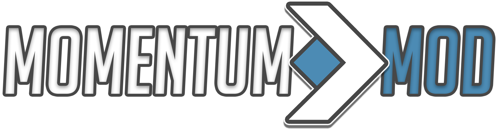

# README

> _Momentum Mod is a standalone game built on the Source Engine, aiming to centralize movement gametypes found in CS:S, CS:GO, and TF2._

The frontend of the site runs Angular 7 and utilizes the ngx-admin/nebular frameworks. It and its instructions can be found in the [client/](client/) folder.

The backend of the website runs NodeJS and Sequelize \(MySQL\). The backend, and instructions to run it can be found in the [server/](server.md) folder.

## _Something wrong with the site?_

[Submit an issue](https://github.com/momentum-mod/website/issues/new) with some pictures and/or web console error output!

## _Want to help out?_

[Join our Discord](https://discord.gg/wQWkRb6) and let us know! We also accept pull requests, _but make sure the issue/feature isn't already assigned to someone!_

